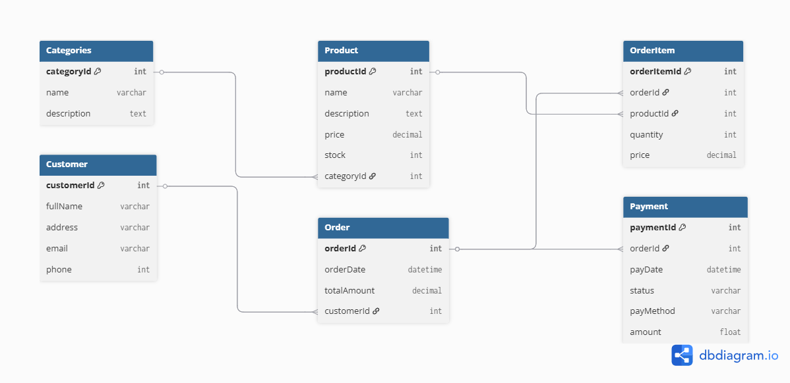

# junior-online-store

Sample online store database project for Junior Data Analyst portfolio.

## Scope

In this project, we'll build a sample online store database that supports:

- Customers and orders and payments  
- Products and categories  
- Inventory tracking  
- Sales reports and dashboards  

## Entity Relationship Diagram (ERD)

The database schema is illustrated below:

## DBML Schema

The schema is also available in DBML format for easy integration with tools like [dbdiagram.io](https://dbdiagram.io).

- [schema.dbml](./schema.dbml)

---

This project is part of a portfolio designed to showcase relational modeling, data analysis, and normalization techniques using SQL-based tools.
